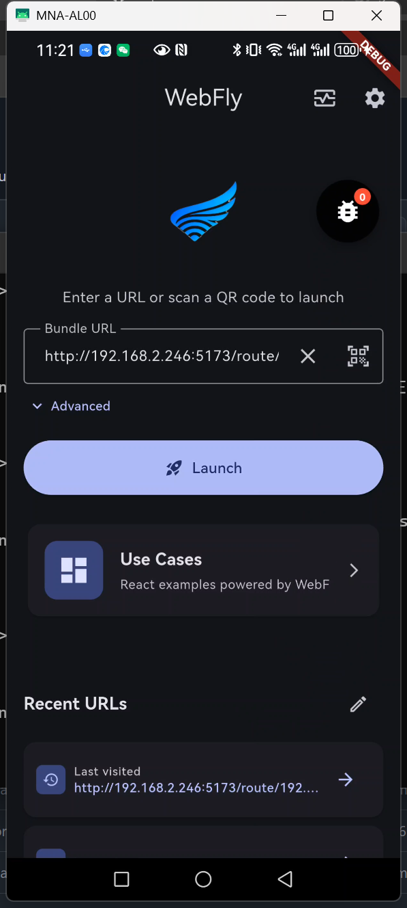
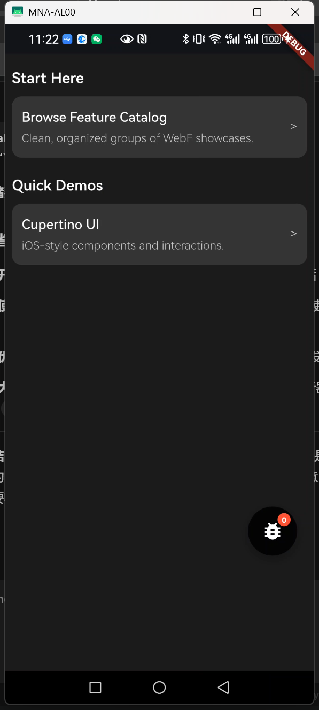
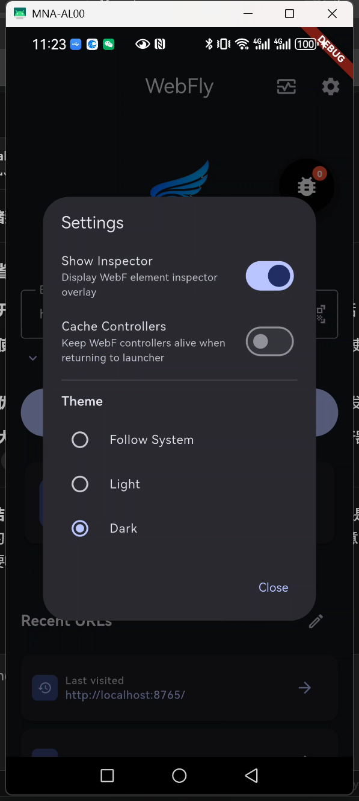
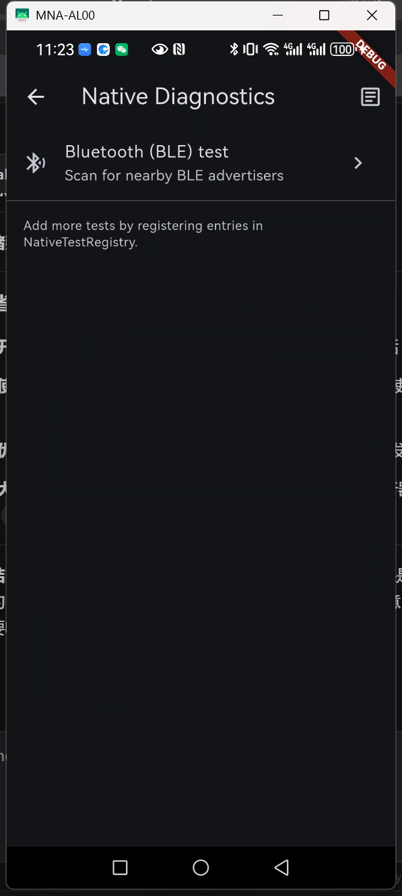
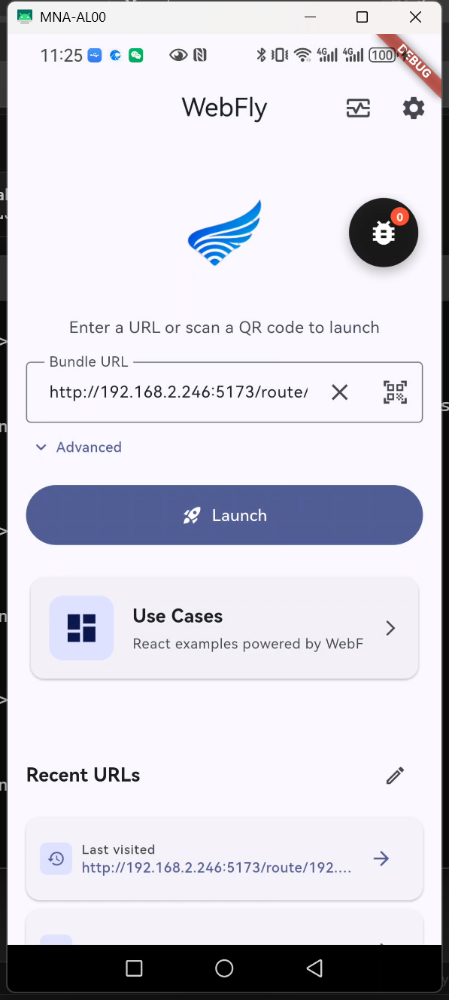
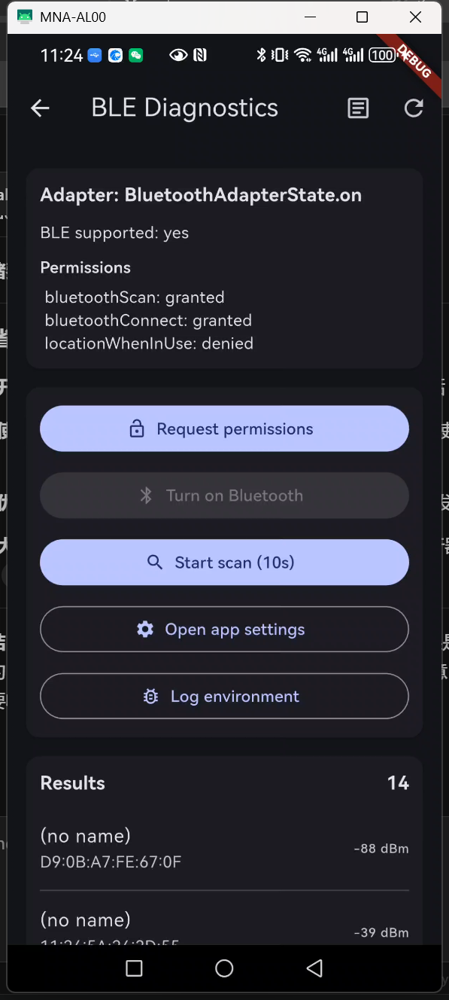

# WebFly 🚀

English | [简体中文](README.zh-CN.md)

<div align="center">


[](https://github.com/anomalyco/webfly/releases)
[](https://flutter.dev)
[](https://dart.dev)
[](https://github.com/openwebf/webf)
[](LICENSE)

**⭐ If you find WebFly useful, please consider giving it a star! ⭐**

*Native capabilities meet web flexibility - The ultimate hybrid runtime*

</div>

---

**WebFly** is a powerful Flutter-based launcher and runtime for web applications with native capabilities. Unlike traditional web containers like Expo Go or WebF Go, WebFly provides deep integration with native device features while maintaining the flexibility of web development.

## 🌟 Why WebFly?

### Native Capabilities Built-in

WebFly isn't just a web viewer - it's a fully-featured native runtime with integrated device APIs:

- **🔵 Bluetooth Low Energy (BLE)** - Direct access to BLE devices via `@webfly/ble` (powered by `flutter_blue_plus` in `webfly_packages/webfly_ble`)
- **🔐 Permissions** - Runtime permission requests via `@webfly/permission` (no startup prompts; request when needed)
- **💾 SQLite Database** - Local database storage with `webf_sqflite`
- **🔗 Native Sharing** - System share sheet integration via `webf_share`
- **📱 Native UI Components** - Seamless Flutter-Web hybrid interfaces
- **🎯 QR Code Scanner** - Built-in mobile scanner for quick app launching

### vs. Expo Go / WebF Go

| Feature | WebFly | Expo Go / WebF Go |
|---------|--------|-------------------|
| **Native APIs** | ✅ Pre-integrated (BLE, SQLite, Share) | ❌ Limited to basic APIs |
| **Custom Native Code** | ✅ Fully customizable | ❌ Requires ejecting |
| **Offline Database** | ✅ SQLite built-in | ⚠️ Limited storage |
| **Device Integration** | ✅ Deep native integration | ⚠️ Basic only |
| **Development** | ✅ Hot reload + Native debugging | ✅ Hot reload only |
| **Distribution** | ✅ Standalone APK/IPA | ⚠️ Requires host app |

## 📸 Screenshots

<div align="center">
  
  
  
  
</div>
<div align="center">
  
   
</div>

## 🎯 Key Features

### 1. **Hybrid Routing System**
- Seamless navigation between web routes and Flutter screens
- Shared WebF controllers for performance
- Route focus management and lifecycle handling

### 2. **Smart URL History**
- Recently visited URLs with quick access
- Swipe-to-delete gesture
- Edit mode with batch operations
- Persistent history across sessions

### 3. **QR Code Launcher**
- Instant app loading via QR scan
- Supports both URL and path parameters
- Perfect for demo and testing

### 4. **Developer Tools**
- WebF Inspector overlay for debugging
- JavaScript console integration
- Network request monitoring
- Configurable settings panel

### 5. **Asset HTTP Server**
- Built-in local server for bundled assets
- Hot reload support during development
- Efficient asset delivery

## 🚀 Getting Started

### Prerequisites

- [Flutter SDK](https://flutter.dev) 3.41.x (stable)
- Android SDK (API 36)
- [pixi](https://pixi.sh/) — cross-platform package manager (manages Rust, just, Node.js, pnpm, Python, and more)

### Quick Start

```bash
# 1. Clone with submodules
git clone --recursive https://github.com/anomalyco/webfly.git
cd webfly

# 2. Configure signing (optional for debug builds)
cp .env.example .env
# Edit .env — fill in KEYSTORE_PASSWORD and KEY_PASSWORD

# 3. One-command setup (installs tools, generates platforms/assets/code)
just setup

# 4. Run on Android
just android
```

`just setup` does the following automatically:
1. Installs pixi-managed tools + pkl via `pixi install`
2. Runs `flutter pub get`
3. Generates platform directories from `app.pkl`
4. Generates logo/branding assets
5. Runs Dart code generation (`build_runner`)
6. Builds bundled use-case web apps
7. Installs git hooks (lefthook) if available
8. Generates Android keystore if env vars are set

### Frontend Development

```bash
cd frontend
pnpm install
pnpm dev        # Vite dev server (auto-port 5173+)
```

## 📱 Usage

### Launching Web Apps

**Method 1: Manual URL Entry**
- Enter a bundle URL (e.g., `http://example.com/bundle.js`)
- Optionally specify a custom path in Advanced options
- Tap "Launch" to start

**Method 2: QR Code Scan**
- Tap the QR code icon
- Scan a QR code containing the bundle URL
- App launches automatically

**Method 3: History**
- Tap any recent URL to fill the input
- Tap the arrow button to launch directly
- Swipe left to delete entries

### Native API Usage in Web Apps

WebFly exposes native modules via `webf.invokeModuleAsync(moduleName, method, ...args)`. The frontend uses typed wrappers from `@webfly/ble` and `@webfly/permission` (Result-based, neverthrow).

**BLE** (`@webfly/ble`):

```javascript
import { startScan, getScanResults, connect, addBleListener } from '@webfly/ble';

const res = await startScan({ timeout: 5000 });
if (res.isOk()) { /* use getScanResults(), connect(), etc. */ }
using bus = new (await import('@webfly/ble')).BleEventBus(); // or addBleListener for single subscription
```

**Permissions** (`@webfly/permission`):

```javascript
import { checkStatus, request } from '@webfly/permission';

const status = await checkStatus('camera');
const granted = await request('camera'); // Shows system dialog when needed
```

**SQLite** (`webf_sqflite`):

```javascript
if (window.webf?.invokeModuleAsync) {
  const db = await window.webf.invokeModuleAsync('Sqflite', 'openDatabase', 'mydb.db');
  // ...
}
```

**Native sharing** (`webf_share`):

```javascript
if (window.webf?.share) {
  await window.webf.share.share({ title: '...', text: '...', url: '...' });
}
```

## 🛠️ Development

### Project Structure

```
webfly/
├── lib/                    # Flutter app sources (Host Application)
│   ├── main.dart           # App entry & WebF module registration
│   ├── ui/                 # Launcher, scanner, native diagnostics, webf views
│   ├── services/           # Asset HTTP server
│   ├── store/              # App settings, URL history
│   └── webf/               # WebF modules (AppSettings) & protocol
├── webfly_packages/        # Feature packages (Dart + TypeScript)
│   ├── webfly_bridge/      # Shared WebF bridge: wire format, createModuleInvoker, WebfModuleEventBus
│   ├── webfly_ble/         # BLE module (flutter_blue_plus)
│   ├── webfly_permission/  # Permission module (permission_handler)
│   └── webfly_theme/       # Theme module
├── frontend/               # Web Application (React + Vite)
│   └── src/                # Pages (BLE Demo, Permission Demo, etc.), hooks, config
├── contrib/webf_usecases/  # Example use-case apps (React and Vue)
├── flutter_tools/          # Rust-based build/release tools (submodule, invoked via just)
├── assets/                 # Static assets & bundled use_cases
├── platforms/              # Platform templates (android signing, manifest)
├── docs/                   # Documentation & screenshots
├── app.pkl                 # Project configuration (app ID, versions, signing)
├── justfile                # Task runner recipes (imports flutter_tools/common.just)
├── pixi.toml               # Pixi tool dependencies (rust, node, pnpm, python, etc.)
├── .env.example            # Environment variable template
└── pubspec.yaml            # Flutter dependencies
```

### Architecture Overview

WebFly adopts a **Hybrid Architecture**:
1.  **Flutter Host**: Provides the native shell, manages permissions, accesses hardware (BLE, storage), and renders the UI chrome (navigation, settings).
2.  **WebF Runtime**: A high-performance web rendering engine based on Flutter, responsible for rendering the web application content.
3.  **Local Asset Server**: A built-in HTTP server (`shelf`) that serves the compiled web app from local assets, ensuring offline availability and fast load times.
4.  **React Frontend**: The UI logic for the business application is built with standard web technologies (React, Vite) and UI components (`@openwebf/react-cupertino-ui`).

### Common Commands

```bash
just --list              # List all available commands

# Development
just android             # Run on Android device (debug)
just android release     # Run on Android device (release)
just windows             # Run on Windows (debug)

# Code quality
just format              # Format Dart code
just format-check        # CI format gate
just analyze             # Static analysis (alias: just lint)

# Testing
just test                # Flutter tests
just test-frontend       # Frontend vitest
just test-all            # All tests

# Code generation
just generate            # Dart build_runner (root + webfly_ble)
just gen-platforms       # Regenerate android/ from app.pkl + platforms/
just gen-assets          # Generate logo/branding images
just use-cases-refresh   # Build bundled use-case web apps

# LED effects
just compile-effects     # Compile effects to plain JS (for mquickjs MCU)

# Build & Release
just build-apk           # Release APK (obfuscated)
just release             # bump version, commit, tag, push (triggers CI)
just release minor       # minor version bump
just ci                  # Full CI pipeline (setup + checks + build)
```

**Frontend (in `frontend/`)**
```bash
pnpm dev                 # Vite dev server
pnpm build               # Production build
pnpm lint                # ESLint
pnpm test                # Vitest
```

### Customization

**Add Custom Native Plugins:**
1. Create a package under `webfly_packages/` (or add dependency to `pubspec.yaml`).
2. Use `webfly_bridge` (Dart: `webfOk`/`webfErr`/`toJson`; TS: `createModuleInvoker`, `WebfModuleEventBus`) for wire format and event bus.
3. Register the module in `lib/main.dart` with `WebF.defineModule(...)` and expose API to the frontend (e.g. `@webfly/ble`-style wrapper).

**Modify UI Theme:**
- Edit `lib/main.dart` for app-wide theme.
- Customize launcher widgets in `lib/ui/launcher/widgets/`.

## ⚙️ Configuration

### Android Signing

Signing passwords are read from environment variables, not checked-in files:

| Variable | Description |
|----------|-------------|
| `KEYSTORE_PASSWORD` | Keystore password |
| `KEY_PASSWORD` | Key password |
| `KEYSTORE_BASE64` | Base64-encoded keystore (CI only) |

**Local development**: Copy `.env.example` to `.env` and fill in the values. The justfile loads `.env` automatically via `set dotenv-load`.

**Generate a keystore** (first time only):
```bash
just gen-android-keystore
```

**Upload secrets to GitHub Actions**:
```bash
just upload-secrets
```

This uploads `KEYSTORE_BASE64`, `KEYSTORE_PASSWORD`, and `KEY_PASSWORD` to GitHub Actions secrets.

### GitHub API Token (Optional)

The app checks for updates via the GitHub Releases API. Without authentication, the rate limit is **60 requests/hour** (shared per IP). To raise it to **5,000 req/h**, add a GitHub fine-grained personal access token:

1. Create a [fine-grained PAT](https://github.com/settings/personal-access-tokens/new) with **Public Repositories (read-only)** access and an expiration ≤ 366 days.
2. Configure the token using **one** of these methods:
   - **Runtime (recommended)**: Open **Settings → Network → GitHub Token** in the app and paste the token. It is persisted locally and never baked into the APK.
   - **Compile-time (dev only)**: Add `GITHUB_TOKEN=github_pat_...` to `.env`. The justfile injects it via `--dart-define` during local builds (skipped in CI to avoid embedding tokens in release APKs).

> **Why `KEYSTORE_BASE64`?** Keystore generation involves randomness — even with the same passwords, each `keytool` invocation produces a different keystore file. APK signed with a different keystore cannot be installed over the previous version. So CI must use the exact same keystore as local development, not generate a new one.

### Permissions & AndroidManifest

- **Bluetooth, notification, etc.** are declared in both `android/app/src/main/AndroidManifest.xml` and `platforms/android/AndroidManifest.main.xml` (kept in sync). This includes `BLUETOOTH_SCAN`, `BLUETOOTH_CONNECT`, `POST_NOTIFICATIONS` (Android 13+), and others.
- **Runtime request**: The app does not request permissions at startup. Request when needed, e.g. open **Permission Demo**, tap **Request** for the desired permission (bluetooth, notification, etc.) to trigger the system dialog; or call `request('bluetoothScan')` / `request('notification')` from your code when using that feature.
- **If still denied**: Make sure you tapped Request for that permission in Permission Demo; if you previously chose “Don’t ask again”, grant the permission in system **Settings → Apps → WebFly → Permissions**.
- **Adding new permissions**: After adding `<uses-permission>` in `android/app/src/main/AndroidManifest.xml`, update `platforms/android/AndroidManifest.main.xml` the same way so both stay in sync.

### App Settings

Access via the settings button (⚙️) in the launcher:

- **WebF Inspector**: Enable/disable developer overlay
- **Cache Controllers**: Keep WebF controllers alive between navigations

### Bundle Server

For development, the built-in HTTP server serves assets from:
- Port: Auto-assigned (check console logs)
- Base URL: `http://localhost:{port}/`
- Asset path: `assets/use_cases/`

## 📦 Dependencies

### Core
- `webf: ^0.24.14` - Web rendering engine
- `signals_flutter: ^6.0.0` - State management
- `go_router: ^17.0.0` - Navigation

### Packages (monorepo in `webfly_packages/`)
- `webfly_bridge` - Shared bridge: wire format (Dart), `createModuleInvoker` / `WebfModuleEventBus` (TS)
- `webfly_ble` - BLE module (Dart + TS), uses `flutter_blue_plus`
- `webfly_permission` - Permission module (Dart + TS), uses `permission_handler`
- `webfly_theme` - Theme module

### Native & Web
- `webf_sqflite: ^1.0.0` - SQLite database
- `mobile_scanner: ^7.1.0` - QR code scanning

### Utilities
- `shared_preferences: ^2.5.0` - Local storage
- `shelf: ^1.4.0` - HTTP server

## 🤝 Contributing

Contributions are welcome! Please feel free to submit a Pull Request.

## 📄 License

MIT

## 🙏 Acknowledgments

Built on top of [WebF](https://github.com/openwebf/webf) - the high-performance web rendering engine for Flutter.

---

**Made with ❤️ for developers who want native power with web flexibility**

