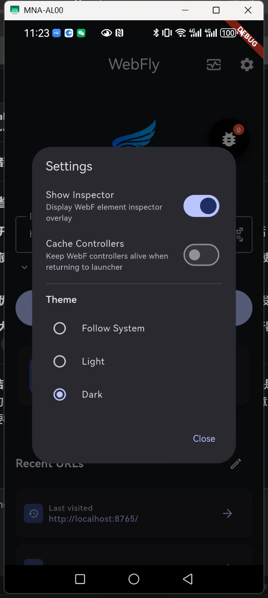
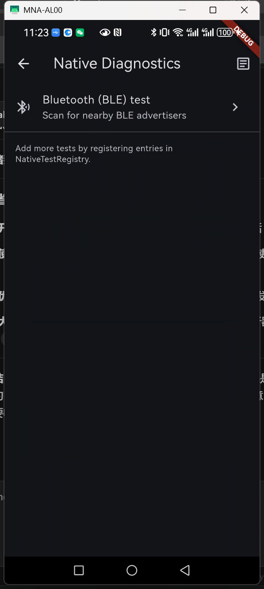
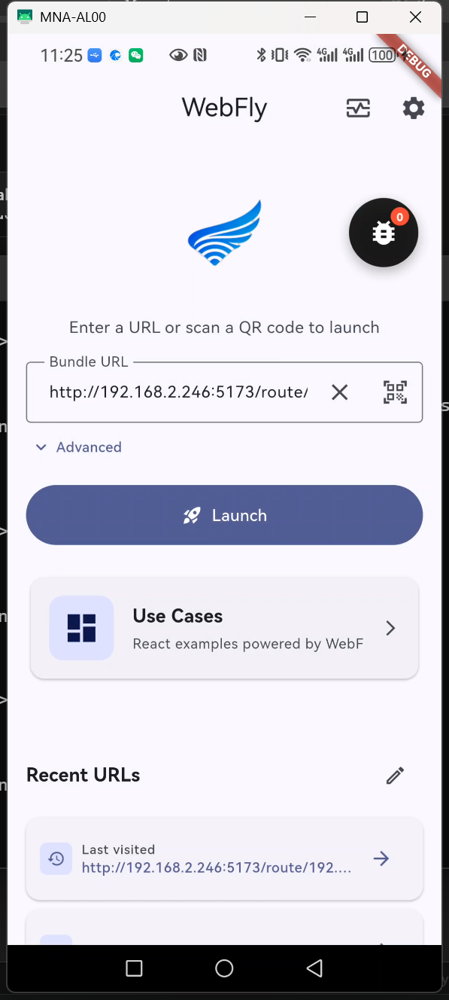
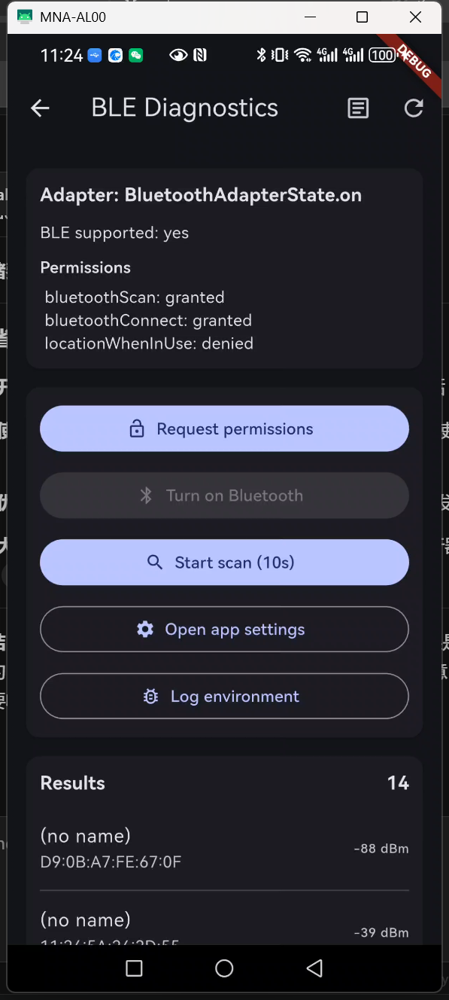

# WebFly 🚀

[English](README.md) | 简体中文

<div align="center">


[](https://flutter.dev)
[](https://dart.dev)
[](https://github.com/openwebf/webf)
[](LICENSE)

**⭐ 如果觉得 WebFly 有用，请给个 Star 支持一下！⭐**

*原生能力与 Web 灵活性的完美结合 - 终极混合运行时*

</div>

---

**WebFly** 是一个强大的基于 Flutter 的 Web 应用启动器和运行时环境，具有原生设备能力。与传统的 Web 容器（如 Expo Go 或 WebF Go）不同，WebFly 提供了与原生设备功能的深度集成，同时保持了 Web 开发的灵活性。

## 🌟 为什么选择 WebFly？

### 内置原生能力

WebFly 不仅仅是一个 Web 浏览器 - 它是一个功能完整的原生运行时，集成了设备 API：

- **🔵 蓝牙低功耗（BLE）** - 通过 `@webfly/ble`（`packages/webfly_ble`，基于 `flutter_blue_plus`）直接访问 BLE 设备
- **🔐 权限** - 通过 `@webfly/permission` 按需请求运行时权限（不在一启动就弹窗，需要时再请求）
- **💾 SQLite 数据库** - 使用 `webf_sqflite` 进行本地数据库存储
- **🔗 原生分享** - 通过 `webf_share` 集成系统分享功能
- **📱 原生 UI 组件** - 无缝的 Flutter-Web 混合界面
- **🎯 二维码扫描** - 内置移动扫描器，快速启动应用

### 对比 Expo Go / WebF Go

| 功能特性 | WebFly | Expo Go / WebF Go |
|---------|--------|-------------------|
| **原生 API** | ✅ 预集成（BLE、SQLite、分享） | ❌ 仅限基础 API |
| **自定义原生代码** | ✅ 完全可定制 | ❌ 需要 eject |
| **离线数据库** | ✅ 内置 SQLite | ⚠️ 存储受限 |
| **设备集成** | ✅ 深度原生集成 | ⚠️ 仅基础功能 |
| **开发调试** | ✅ 热重载 + 原生调试 | ✅ 仅热重载 |
| **应用分发** | ✅ 独立 APK/IPA | ⚠️ 需要宿主应用 |

## 📸 应用截图

<div align="center">
  
  
  
  
</div>
<div align="center">
  
   
</div>

## 🎯 核心特性

### 1. **混合路由系统**
- Web 路由与 Flutter 页面之间无缝导航
- 共享 WebF 控制器以提升性能
- 路由焦点管理和生命周期处理

### 2. **智能 URL 历史**
- 最近访问的 URL 快速访问
- 右滑删除手势
- 编辑模式支持批量操作
- 跨会话持久化历史记录

### 3. **二维码启动器**
- 扫描二维码即时加载应用
- 支持 URL 和路径参数
- 非常适合演示和测试

### 4. **开发者工具**
- WebF 检查器覆盖层用于调试
- JavaScript 控制台集成
- 网络请求监控
- 可配置的设置面板

### 5. **资源 HTTP 服务器**
- 为打包资源提供内置本地服务器
- 开发期间支持热重载
- 高效的资源交付

## 🚀 快速开始

### 前置要求

- Flutter SDK（Dart ^3.10.7）
- Android SDK（用于 Android 构建）
- pnpm（前端开发用；仅跑 Flutter 可省略）

### 安装步骤

1. **克隆仓库**
   ```bash
   git clone https://github.com/your-org/webfly.git
   cd webfly
   ```

2. **初始化 submodule**
  ```bash
  git submodule update --init --recursive
  ```

3. **安装 Flutter 依赖**
   ```bash
   flutter pub get
   ```

4. **安装 Web 依赖**（用于示例用例）
   ```bash
  cd frontend
  pnpm install
   ```

5. **运行应用**
   ```bash
  # 从仓库根目录
  flutter run
   ```

## 📱 使用方法

### 启动 Web 应用

**方法 1：手动输入 URL**
- 输入 bundle URL（例如：`http://example.com/bundle.js`）
- 可选择在高级选项中指定自定义路径
- 点击"启动"开始运行

**方法 2：扫描二维码**
- 点击二维码图标
- 扫描包含 bundle URL 的二维码
- 应用自动启动

**方法 3：历史记录**
- 点击任意最近的 URL 填充输入框
- 点击箭头按钮直接启动
- 向左滑动删除条目

### 在 Web 应用中使用原生 API

WebFly 通过 `webf.invokeModuleAsync(moduleName, method, ...args)` 暴露原生模块，前端使用 `@webfly/ble`、`@webfly/permission` 等类型化封装（Result 风格，neverthrow）。

**BLE**（`@webfly/ble`）：

```javascript
import { startScan, getScanResults, connect, addBleListener } from '@webfly/ble';

const res = await startScan({ timeout: 5000 });
if (res.isOk()) { /* 可调用 getScanResults()、connect() 等 */ }
// 使用 addBleListener 订阅事件，或 using bus = new BleEventBus()
```

**权限**（`@webfly/permission`）：

```javascript
import { checkStatus, request } from '@webfly/permission';

const status = await checkStatus('camera');
const granted = await request('camera'); // 需要时会弹出系统权限框
```

**SQLite**（`webf_sqflite`）、**原生分享**（`webf_share`）等仍通过 `window.webf` 对应模块调用。

## 🛠️ 开发指南

### 项目结构

```
webfly/
├── lib/                    # Flutter 应用源码（宿主应用）
│   ├── main.dart           # 入口 & WebF 模块注册
│   ├── ui/                 # 启动器、扫描、原生诊断、WebF 视图
│   ├── services/           # 资源 HTTP 服务器
│   ├── store/              # 应用设置、URL 历史
│   └── webf/               # WebF 模块（AppSettings）与协议
├── packages/               # 共享与功能包
│   ├── webf_bridge/        # 共享 WebF 桥（Dart + TS）：报文格式、createModuleInvoker、WebfModuleEventBus
│   ├── webfly_ble/         # BLE WebF 模块（Dart + TS），flutter_blue_plus
│   └── webfly_permission/  # 权限 WebF 模块（Dart + TS），permission_handler
├── frontend/               # Web 应用（React + Vite）
│   └── src/                # 页面（BLE Demo、Permission Demo 等）、hooks、配置
├── assets/                 # 静态资源与打包用例
├── platforms/              # 平台模板（android 等）
├── docs/                   # 文档与截图
└── pubspec.yaml            # Flutter 依赖（webf_bridge、webfly_ble、webfly_permission）
```

### 架构概览

WebFly 采用 **混合架构** 设计：
1.  **Flutter 宿主**: 提供原生外壳，管理权限，访问硬件资源（BLE, 存储），并渲染原生 UI 框架（导航, 设置）。
2.  **WebF 运行时**: 基于 Flutter 的高性能 Web 渲染引擎，负责渲染 Web 应用内容。
3.  **本地资源服务器**: 内置 HTTP 服务器 (`shelf`)，从本地资源提供编译后的 Web 应用，确保离线可用性和快速加载。
4.  **React 前端**: 业务逻辑和 UI 使用标准 Web 技术栈 (React, Vite) 和 UI 组件库 (`@openwebf/react-cupertino-ui`) 构建。

### 开发工具

WebFly 包含了基于 Rust 的自定义工具（位于 `flutter_tools/`），用于增强开发工作流（设备选择、生成平台目录、生成 Logo、记录日志等）。

### Flutter 任务（Just）

从仓库根目录运行：

```bash
# 生成平台目录（从 platforms/ 模板生成）
just gen-platforms

# 只生成 Logo（不应用）
just logo

# 生成 Logo 并应用到 launcher icons / splash
just gen-logo

# 运行 Android（自动选择设备）
just android

# 运行 Windows
just windows

# 构建发布版 APK
just build-apk
```

### Web 开发

```bash
cd frontend
pnpm dev
pnpm build
```

### 从源码构建

**Android APK**
```bash
# 通过 just（推荐）：
just build-apk

# 或手动执行：
flutter build apk --release --obfuscate --split-debug-info=build/app/outputs/symbols
```

**Android App Bundle**
```bash
flutter build appbundle --release
```

### 自定义开发

**添加自定义原生插件：**
1. 在 `packages/` 下新建包（或往 `pubspec.yaml` 增加依赖）
2. 使用 `webf_bridge`（Dart：`webfOk`/`webfErr`/`toWebfJson`；TS：`createModuleInvoker`、`WebfModuleEventBus`）做报文与事件总线
3. 在 `lib/main.dart` 中 `WebF.defineModule(...)` 注册，并在前端提供类似 `@webfly/ble` 的封装

**修改 UI 主题：**
- 编辑 `lib/main.dart` 修改应用全局主题
- 在 `lib/ui/launcher/widgets/` 中自定义启动器组件

## ⚙️ 配置说明

### 权限与 AndroidManifest

- **Bluetooth、Notification 等**：已在 `android/app/src/main/AndroidManifest.xml` 和 `platforms/android/AndroidManifest.main.xml` 中声明（两者已同步维护）。包括 `BLUETOOTH_SCAN`、`BLUETOOTH_CONNECT`、`POST_NOTIFICATIONS`（Android 13+）等。
- **运行时请求**：应用不会在启动时自动弹权限框。需要在**使用到该能力时**再请求，例如：
  - 打开 **Permission Demo** 页，对「bluetooth」「notification」等点击 **Request**，系统会弹出授权框；
  - 或在使用 BLE 功能时由业务代码调用 `request('bluetoothScan')` / `request('bluetoothConnect')` 等。
- **若仍显示 denied**：先确认已在 Permission Demo 中对该权限点过 Request；若之前选过「拒绝且不再询问」，需到系统设置里为该应用手动开启对应权限。
- **新增权限时**：在 `android/app/src/main/AndroidManifest.xml` 中增加 `<uses-permission>` 后，请同步修改 `platforms/android/AndroidManifest.main.xml`，保持两处一致。

### 应用设置

通过启动器中的设置按钮（⚙️）访问：

- **WebF 检查器**：启用/禁用开发者覆盖层
- **缓存控制器**：在导航之间保持 WebF 控制器活跃

### Bundle 服务器

在开发时，内置 HTTP 服务器从以下位置提供资源：
- 端口：自动分配（查看控制台日志）
- 基础 URL：`http://localhost:{port}/`
- 资源路径：`assets/use_cases/`

## 📦 依赖项

### 核心
- `webf: ^0.24.11` - Web 渲染引擎
- `signals_flutter: ^6.3.0` - 状态管理
- `go_router: ^17.0.1` - 导航

### 包（本仓库）
- `webf_bridge` - 共享桥：报文格式（Dart）、`createModuleInvoker` / `WebfModuleEventBus`（TS）
- `webfly_ble` - BLE WebF 模块（Dart + TS），使用 `flutter_blue_plus`
- `webfly_permission` - 权限 WebF 模块（Dart + TS），使用 `permission_handler`

### 原生与 Web
- `webf_sqflite: ^1.0.1` - SQLite
- `webf_share: ^1.1.0` - 原生分享
- `mobile_scanner: ^7.1.4` - 二维码扫描

### 工具库
- `shared_preferences: ^2.5.4` - 本地存储
- `shelf: ^1.4.2` - HTTP 服务器

## 🤝 贡献指南

欢迎贡献！请随时提交 Pull Request。

## 📄 许可证

[在此添加您的许可证]

## 🙏 致谢

基于 [WebF](https://github.com/openwebf/webf) 构建 - 高性能的 Flutter Web 渲染引擎。

---

**用 ❤️ 为需要原生能力和 Web 灵活性的开发者打造**
